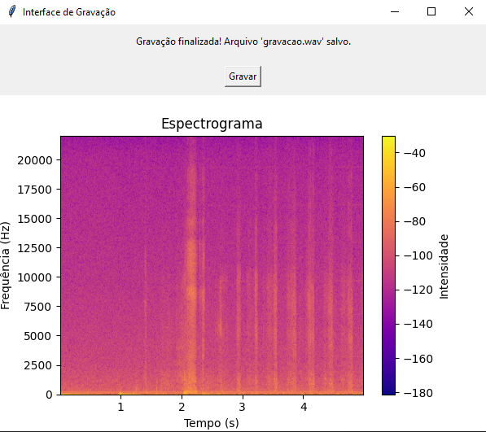

# tcc

- [Explicamento do codigo](explicacaoCodigo.md)

- [Interface](README.md)

Primeiro fizemos uma interface simples usando a biblioteca _TKINTER_ para a criação da janela e dos botões.

Ao apertar o botão para a gravação, 5 segundos de áudio serão gravados, e em seguida aparecerá a imagem do espectograma do audio gravado.

